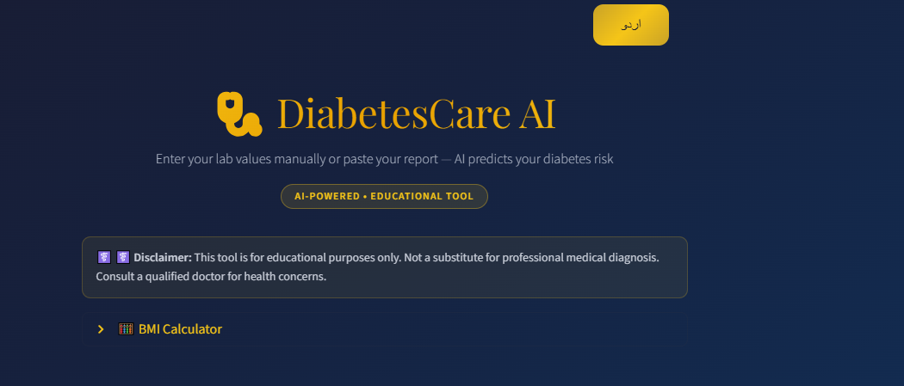
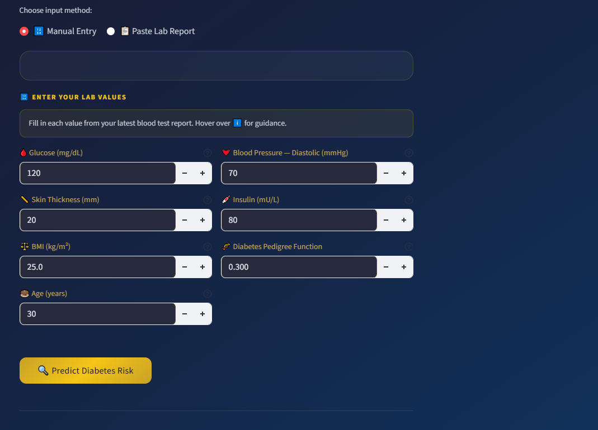
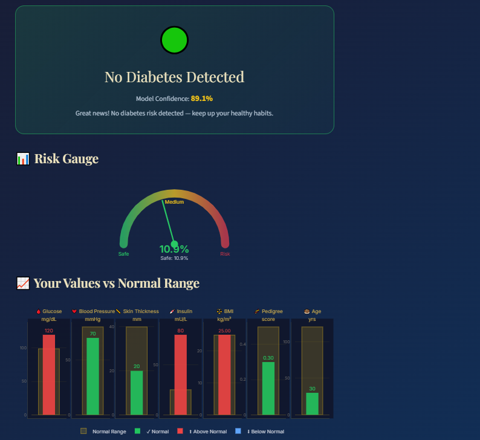
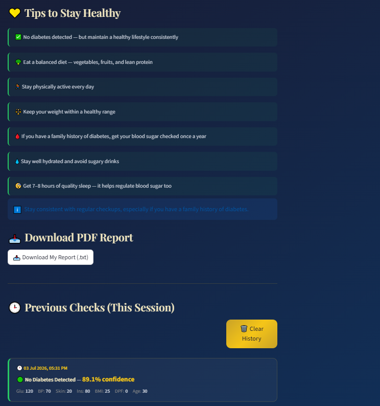

# 🩺 DiabetesCare AI

**An AI-powered diabetes risk prediction assistant with natural-language lab report parsing, bilingual support, and interactive health visualizations.**

🔗 **Live Demo:** [your-health-assistent-c5bgjggd7xtabmvozv3qxt.streamlit.app](https://your-health-assistent-c5bgjggd7xtabmvozv3qxt.streamlit.app/)


---

## Overview

DiabetesCare AI is a machine learning web application that predicts a user's diabetes risk from standard clinical indicators (glucose, blood pressure, BMI, insulin, etc.). Beyond a standard prediction form, it includes a **natural-language report parser** — users can paste raw lab report text or doctor's notes, and the app automatically extracts the relevant health values using regex-based NLP, only prompting for whatever couldn't be found.

Built as an educational tool, it pairs the prediction with clear visual context (risk gauge, normal-range comparison charts) and actionable health guidance rather than just a raw yes/no output.

## ✨ Features

- **Dual input modes**
  - **Manual entry** — guided form with medical reference ranges on hover
  - **Paste & extract** — paste a lab report or doctor's note; a regex-based NLP parser extracts Glucose, Blood Pressure, BMI, Insulin, Skin Thickness, Diabetes Pedigree Function, and Age automatically, flagging any missing fields for manual input
- **ML-powered prediction** — Logistic Regression model trained on the PIMA Indians Diabetes Dataset, returning both a prediction and a model confidence score
- **Visual risk gauge** — custom SVG gauge showing risk percentage on a Safe → Medium → Risk scale
- **Value comparison chart** — interactive Plotly chart comparing each of the user's lab values against clinical normal ranges
- **Personalized guidance** — categorized precautions (Diet, Exercise, Medical, Lifestyle) for at-risk results, and preventive tips for healthy results
- **Bilingual UI** — full English ⇄ Urdu toggle, including RTL-appropriate Urdu health guidance
- **Session history** — tracks all checks performed in the current session for quick comparison
- **Downloadable report** — generates a plain-text summary report of results and values for the user to save
- **BMI calculator** — built-in height/weight → BMI utility with category classification

## 🧠 How the Prediction Works

- **Model:** Logistic Regression (`scikit-learn`, L2-regularized)
- **Training data:** PIMA Indians Diabetes Dataset
- **Input features:** Glucose, Blood Pressure, Skin Thickness, Insulin, BMI, Diabetes Pedigree Function, Age
- **Output:** Binary risk classification with associated confidence score

> ⚕️ **Disclaimer:** This tool is built for educational purposes only. It does not constitute medical advice or diagnosis. Always consult a qualified healthcare professional for medical concerns.

## 🛠️ Tech Stack

| Layer | Technology |
|---|---|
| Frontend / App Framework | Streamlit |
| ML Model | scikit-learn (Logistic Regression) |
| Data Handling | NumPy, Pandas |
| Visualization | Plotly, custom SVG |
| Model Serialization | Joblib |
| Text Extraction | Python `re` (regex-based NLP) |

## 🚀 Getting Started

### Prerequisites
- Python 3.9+
- pip

### Installation

```bash
# Clone the repository
git clone https://github.com/uroojbuilds/Diabetes-Care-Ai.git
cd Diabetes-Care-Ai

# Install dependencies
pip install -r requirement.txt

# Run the app
streamlit run app.py
```

The app will open automatically at `http://localhost:8501`.

## 📁 Project Structure

```
Diabetes-Care-Ai/
├── app.py                 # Main Streamlit application (UI, NLP parser, charts, logic)
├── diabetes_model.pkl      # Trained Logistic Regression model
├── test_model.py           # Quick script to load and inspect the trained model
├── requirement.txt         # Project dependencies
└── README.md
```

## 🖼️ Screenshots

<table>
  <tr>
    <td align="center"><b>Home</b></td>
    <td align="center"><b>Input Form</b></td>
  </tr>
  <tr>
    <td></td>
    <td></td>
  </tr>
  <tr>
    <td align="center"><b>Prediction Result</b></td>
    <td align="center"><b>Personalized Health Tips</b></td>
  </tr>
  <tr>
    <td></td>
    <td></td>
  </tr>
</table>

## 🗺️ Roadmap

- [ ] PDF export for reports (currently `.txt`)
- [ ] Expand parser coverage for lab report formats (HbA1c, lipid panel)
- [ ] Model comparison (Random Forest / XGBoost) with SHAP explainability
- [ ] User accounts for persistent history across sessions

## 📄 License

This project is open source and available.

---

<p align="center">Built with ❤️ by <a href="https://github.com/uroojbuilds">Urooj</a></p>
